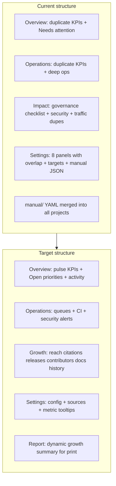

# Dashboard Growth Refactor — Technical Plan & Checklist

**Status:** Implemented (2026-06-28)  
**Project:** MOLE — OSS Impact Dashboard (`oss-impact-dashboard-dev`)  
**Audience:** Maintainers (CSRC-SDSU / OSE steering council)  
**Last updated:** 2026-06-28

---

## Purpose

Refocus the dashboard on **dynamic, maintainer-actionable growth metrics** for MOLE. The tool should give the team quick access to current project health and adoption signals—not duplicate governance docs, static checklists, or hand-maintained narrative that goes stale.

The printable report should remain useful as **growth evidence** (citations, contributors, releases, docs reach) without explicit funding language.

Aligned with MOLE’s **Evaluation and Growth** pillar ([`docs/research-report.md`](research-report.md)) and the content-reduction audit ([`temp/dashboard-content-reduction-audit (1).md`](../temp/dashboard-content-reduction-audit%20(1).md)).

### Guiding principles

| Principle | Meaning |
|-----------|---------|
| **Dynamic only on dashboard** | Show metrics that change every build from APIs or computed GitHub history |
| **No manual narrative** | Remove accomplishments, risks, capacity, case studies, targets from pipeline and UI |
| **No redundancy** | Same metric should not appear on multiple pages without distinct decision context |
| **Minimal project YAML** | Only identifiers, source toggles, and thresholds that cannot be fetched |
| **Hide empty/unavailable** | Do not render panels with null, N/A, or one-time 100% checklists |



---

## Part A — Repository-wide manual / custom data audit

Everything below is **not refreshed from external APIs on each build** (or is hand-edited config pretending to be metrics). Each item includes a disposition for this refactor.

### A.1 `manual/` folder — **DELETE entirely**

| File | Contents | Pipeline today | UI today | Disposition |
|------|----------|----------------|----------|-------------|
| [`manual/project-data.yml`](../manual/project-data.yml) | MOLE accomplishments, maintainer capacity (incl. NSF funding amounts), risks, requested work, **targets** | `collectors/manual.py` → `impact.manual.project_data`, `targets_progress` | **Not rendered** on dashboard/report; Settings shows targets table (baseline only) | **Delete file + remove collector** |
| [`manual/case-studies.yml`](../manual/case-studies.yml) | 3 hand-written case studies | → `impact.manual.case_studies` | **Not rendered** (`renderCaseStudies` never called) | **Delete file + remove collector** |

**Architectural bug:** `manual/` is **global**—MOLE narrative is merged into every built dataset, including `projects/example.json`.

**Actions:**
- [ ] Delete [`manual/`](../manual/) directory
- [ ] Delete [`src/oss_impact_dashboard/collectors/manual.py`](../src/oss_impact_dashboard/collectors/manual.py)
- [ ] Remove `load_manual`, `manual_root` CLI flag, and all `impact.manual` / `targets_progress` from [`build_dataset.py`](../src/oss_impact_dashboard/build_dataset.py)
- [ ] Delete [`src/oss_impact_dashboard/metrics/targets.py`](../src/oss_impact_dashboard/metrics/targets.py) and [`tests/test_targets.py`](../tests/test_targets.py)
- [ ] Remove `targets_progress` from schema ([`schema.py`](../src/oss_impact_dashboard/schema.py)) and validation
- [ ] Remove workflow path triggers for `manual/**` in [`.github/workflows/`](../.github/workflows/)
- [ ] Regenerate [`web/public/data/*.json`](../web/public/data/) without manual fields

### A.2 `projects/*.yml` — reduce to non-derivable config

#### Fields to **remove from YAML** (use code defaults or auto-derive)

| Field | Current use | Why removable | Replacement |
|-------|-------------|---------------|-------------|
| **`core_contributors`** | `external_contributor_share`, `core_contributors_configured`, governance composite | Manual roster; stale; team knows who core is | **Remove metric and UI**; keep computed bus factor & concentration |
| **`label_aliases`** | Normalize label names in operations metrics | GitHub labels are authoritative; MOLE-specific map duplicates repo state | **Use GitHub label names as-is**; case-insensitive match for bug detection (`bug`, `Bug`) in code |
| **`priority_label_patterns`** | Priority queue detection | Already defaulted in [`config.py`](../src/oss_impact_dashboard/config.py) (`priority`, `urgent`) | **Code default only**; drop from project YAML |
| **`documentation_url`** | Header links, report | GitHub repo `homepage` field often set | **Auto-derive** from GitHub `repository.homepage` with YAML override optional |
| **`citation_url`** | Header | Can derive from repo `CITATION.cff` path on GitHub | **Auto-derive** default `…/blob/main/CITATION.cff`; keep override for edge cases |
| **`project.name`** | Display title | GitHub `full_name` or repo description | **Auto-derive** from GitHub; YAML `name` becomes optional override |

#### Fields to **keep in YAML** (true config / external IDs)

| Field | Reason |
|-------|--------|
| `project.id` | Credential suffix (`GITHUB_TOKEN_MOLE`), manifest key |
| `project.repository` | Collector entry point |
| `project.environment` | Sandbox banner, snapshot partitioning |
| `sources.*` toggles | Per-project integration scope |
| `sources.zenodo.record_or_doi`, `openalex.doi`, `documentation_analytics.site_url` | External record IDs not inferrable from GitHub alone |
| `reporting.default_period_months`, `stale_days`, `freshness_warning_hours` | Operational thresholds, not API data |

#### MOLE-specific YAML cleanup checklist

- [ ] Remove `label_aliases`, `priority_label_patterns`, `core_contributors` from [`projects/mole.yml`](../projects/mole.yml) and [`projects/mole-local.yml`](../projects/mole-local.yml)
- [ ] Remove same fields from [`projects/example.yml`](../projects/example.yml) template
- [ ] Remove fields from [`ProjectConfig`](../src/oss_impact_dashboard/config.py) dataclass (or mark deprecated → ignored)
- [ ] Update [`build_operations`](../src/oss_impact_dashboard/metrics/operations.py) to use GitHub labels directly + built-in priority patterns
- [ ] Update [`build_contributors`](../src/oss_impact_dashboard/metrics/contributors.py): drop `core_contributors` param, `external_contributor_share`, `core_contributors_configured`
- [ ] Add GitHub metadata enrichment in [`build_dataset.py`](../src/oss_impact_dashboard/build_dataset.py): populate `project.documentation_url`, `project.name` from repo API when absent in YAML

### A.3 Python — hardcoded / derived static logic

| Location | What | UI | Disposition |
|----------|------|-----|-------------|
| [`build_dataset.py`](../src/oss_impact_dashboard/build_dataset.py) `metric_definitions` (~40 strings) | Glossary embedded in every JSON | Settings panel | **Move to docs** or inline `(i)` tooltips on KPIs; stop shipping full dict in JSON |
| [`metrics/governance.py`](../src/oss_impact_dashboard/metrics/governance.py) | Composite checklist score | Settings Governance health | **Remove module usage** from build + UI |
| [`metrics/community.py`](../src/oss_impact_dashboard/metrics/community.py) `STANDARDS_CHECKLIST` | File presence checklist | Settings Community standards | **Disable collector + remove UI** |
| [`metrics/adoption.py`](../src/oss_impact_dashboard/metrics/adoption.py) | Registry presence labels | Settings Package adoption | **Disable for MOLE + remove UI** |
| [`metrics/security.py`](../src/oss_impact_dashboard/metrics/security.py) `KEY_CHECKS` | OpenSSF check name filter | Settings Security health | **Keep** — taxonomy filter; data from Scorecard API |
| [`collectors/package_adoption.py`](../src/oss_impact_dashboard/collectors/package_adoption.py) | Fixed registry list | Adoption matrix | **Keep collector** for future; disabled in MOLE YAML |
| [`snapshots.py`](../src/oss_impact_dashboard/snapshots.py) | Snapshot field list | Impact history chart | **Keep** — append-only history from prior builds |

### A.4 Web — static content & dead code

| Location | Issue | Disposition |
|----------|-------|-------------|
| [`web/public/data/projects/*.json`](../web/public/data/projects/) | Contains `impact.manual`, `targets_progress`, bloated ~38k lines | Regenerate after pipeline trim |
| [`web/src/app.js`](../web/src/app.js) | Dead: `renderManualSection`, `renderCaseStudies`, `reportList`, `manualItemText` | **Delete** |
| [`web/src/app.js`](../web/src/app.js) | Live but removing: `renderTargetsProgress`, `renderGovernanceHealth`, `renderCommunityStandards`, `renderAdoptionMatrix`, `renderContributorDiversity` (Settings) | **Delete renderers + HTML panels** |
| [`web/src/registry.js`](../web/src/registry.js) | Never imported | **Delete** |
| [`web/src/styles.css`](../web/src/styles.css) `.case-study` rules | Unused | **Delete** |
| [`README.md`](../README.md) | Claims Impact tracks "accomplishments, funding, risks, case studies" | **Update** to dynamic growth metrics only |

### A.5 Tests & fixtures

| File | Issue | Disposition |
|------|-------|-------------|
| [`tests/fixtures/manual/funding.yml`](../tests/fixtures/manual/funding.yml) | Stale name (`funding.yml`) | **Delete** fixture dir |
| [`tests/test_manual_data.py`](../tests/test_manual_data.py) | Asserts live MOLE manual content | **Delete** or rewrite with isolated tmp fixtures |
| [`tests/test_targets.py`](../tests/test_targets.py) | Targets feature tests | **Delete** with targets module |
| [`tests/test_config_dataset.py`](../tests/test_config_dataset.py) | `test_core_contributors_populated` | **Remove** MOLE-specific assertion |
| [`tests/test_build_index.py`](../tests/test_build_index.py) | `--manual-root` in build-index test | Remove manual-root from test invocations |
| [`tests/test_impact_release_contributors.py`](../tests/test_impact_release_contributors.py) | `core_contributors_configured` assertions | Update after metric removal |

### A.6 Docs — stale references (not pipeline input)

| File | Stale content | Disposition |
|------|---------------|-------------|
| [`docs/ARCHITECTURE.md`](ARCHITECTURE.md) | Documents `manual/*.yml`, core_contributors, targets | **Update** after implementation |
| [`docs/GETTING_STARTED.md`](GETTING_STARTED.md) | Manual layer references | **Update** |
| [`docs/technical-plan.md`](technical-plan.md) | Instructions to populate `manual/funding.yml` | **Archive note** or update paths |
| [`docs/research-report.md`](research-report.md) | Research archive referencing funding.yml, targets roadmap | **Keep as historical research**; add note that implementation diverged |

### A.7 Other paths

| Path | Notes |
|------|-------|
| [`reports/`](../reports/) | PDF output dir; gitignored artifacts — **keep** |
| [`temp/dashboard-content-reduction-audit (1).md`](../temp/dashboard-content-reduction-audit%20(1).md) | Prior audit — **keep** as reference |
| [`.github/workflows/`](../.github/workflows/) | MOLE defaults, `manual/**` watch paths — **generalize / remove manual watch** |
| [`.env.example`](../.env.example) | Token placeholders — **keep** |

### A.8 Keyword disposition summary

| Keyword | Disposition |
|---------|-------------|
| `targets` / `targets_progress` | **Remove entirely** (no UI, no pipeline, no YAML) — revisit in future if authoritative source exists |
| `accomplishments`, `maintainer_capacity`, `risks`, `requested_work` | **Remove** with `manual/` |
| `case_studies` | **Remove**; citations covered by OpenAlex + Zenodo |
| `core_contributors` | **Remove** from YAML, metrics, UI |
| `label_aliases` | **Remove** from YAML; use GitHub labels |
| `priority_label_patterns` | **Remove** from YAML; code defaults |
| `funding.yml` | Already renamed; **delete stale fixture + doc refs** |

---

## Part B — UI refactor (dashboard, settings, report)

### Phase 1 — Information architecture and naming

| Current | Proposed | Rationale |
|---------|----------|-----------|
| **Needs attention** | **Open priorities** | Action-oriented maintainer queue |
| **Impact** (nav tab) | **Growth** | Evaluation and Growth pillar; dynamic signals |
| **Response percentiles** (Operations chart) | **Close, merge, and age distribution** | Accurate chart description |
| **Annual targets progress** | *(removed)* | No targets defined; defer to future |
| **Package adoption** | *(removed)* | Not meaningful for MOLE (1/4 registries, no downloads) |

**Page intros:**
- **Overview:** Current health and items needing maintainer action.
- **Operations:** Issue and PR workflow, triage queues, CI, and open security alerts.
- **Growth:** Adoption signals, citations, releases, contributors, and documentation reach.
- **Settings:** Integration health and metric reference.

**Checklist:**
- [ ] Update [`web/index.html`](../web/index.html) nav, section IDs (`#impact` → `#growth`), headings, leads
- [ ] Update [`web/settings.html`](../web/settings.html) — remove dropped panels
- [ ] Update [`web/src/app.js`](../web/src/app.js) section render orchestration

### Phase 2 — Overview tab

**Keep**
- Slimmed KPI strip (**5 cards**): Open issues, Open PRs, Net backlog change (+ period delta), Latest release age, Open over threshold
- Activity trend chart
- **Open priorities** panel (renamed; data from `operations.queues`)

**Remove from Overview KPI strip** (Operations-only): Untriaged, PRs awaiting review, Median first response, CI success rate

**Checklist:**
- [ ] Slim [`renderOverviewSummary`](../web/src/app.js) (~L299)
- [ ] Rename panel in [`index.html`](../web/index.html) L79
- [ ] Rename [`renderActionSummary`](../web/src/app.js) labels if needed

### Phase 3 — Operations tab

**Keep:** Filters, export, table, Operations KPI strip, backlog/age/label charts, CI reliability, review load, queue panels

**Add:** Compact **open security alerts** panel from `github_security` (MOLE: 6 Dependabot alerts — dynamic). Show when alerts > 0; link to GitHub Security tab.

**Remove from Growth tab:** GitHub security posture panel (relocated here)

**Checklist:**
- [ ] Add `data-section="securityAlerts"` panel to Operations grid in `index.html`
- [ ] Implement compact `renderSecurityAlerts()` in `app.js`
- [ ] Remove [`renderGithubSecurity`](../web/src/app.js) from Growth render path

### Phase 4 — Growth tab (formerly Impact)

**Remove panels**
- Repository governance (`data-section="githubGovernance"`)
- GitHub security posture (moved to Operations)

**Keep (dynamic)**
- Slimmed Growth KPI strip: Citations, Stars, Forks, Unique contributors, New contributors (period delta), Total releases, Zenodo downloads, Documentation visitors
- GitHub repository reach (full traffic + daily chart)
- Citations by year, Release delivery + asset downloads chart
- Contributor trend + Contributors and community (**merge in** bus factor, newcomer funnel, concentration — drop "Core configured" and external share)
- Development velocity, Documentation analytics, Impact history (when ≥2 snapshots)

**Remove from Growth KPI strip:** Repo views/clones/unique 14d cards (duplicate of GitHub reach panel)

**Checklist:**
- [ ] Slim [`renderImpactSummary`](../web/src/app.js) (~L341)
- [ ] Remove governance panel from `index.html` L217–219
- [ ] Remove security panel from Growth grid L248–250
- [ ] Extend contributors panel renderer with bus factor + newcomer funnel
- [ ] Rename Impact → Growth in user-visible strings

### Phase 5 — Settings & diagnostics

**Merge**
- Source availability absorbs **Enabled sources** subsection from Project configuration

**Remove panels**
- Package adoption
- Governance health
- Community standards checklist
- Contributor diversity (merged into Growth)
- **Annual targets progress** (dropped entirely)

**Keep**
- Project configuration (slimmed — no Enabled sources)
- Source availability
- Metric definitions → **future:** migrate to KPI hover tooltips ([`temp/dashboard-content-reduction-audit (1).md`](../temp/dashboard-content-reduction-audit%20(1).md))
- Security health (OpenSSF Scorecard — when `security.available`)

**Checklist:**
- [ ] Remove panels from [`settings.html`](../web/settings.html) L58–75 (keep securityHealth only)
- [ ] Remove render calls in `app.js` init (~L2096–L2106)
- [ ] Remove Enabled sources block in `renderProjectConfig` (~L1749–1758)

### Phase 6 — Print report

**Keep (dynamic):** Executive KPIs, reach/adoption, development activity, releases, contributors, CI, compact security (OpenSSF + GitHub alerts)

**Remove:** Repository governance section (~L1988–2000 in `renderReport`), any manual sections

**Do not add:** Targets section (deferred)

**Retitle:** `{Project} — Open Source Growth Report`

**Checklist:**
- [ ] Update [`renderReport`](../web/src/app.js) (~L1830)
- [ ] Remove governance block
- [ ] Confirm no manual/case-study sections reintroduced

### Phase 7 — Backend collectors (MOLE)

Disable in [`projects/mole.yml`](../projects/mole.yml) and [`projects/mole-local.yml`](../projects/mole-local.yml):

```yaml
community_standards:
  enabled: false
package_adoption:
  enabled: false
```

Keep collectors in codebase for other projects via [`projects/example.yml`](../projects/example.yml).

**Checklist:**
- [ ] Update both MOLE project YAML files
- [ ] Optionally skip `build_governance` / `build_adoption` when sources disabled (already gated)

### Phase 8 — Dead code & docs cleanup

- [ ] Delete `web/src/registry.js`
- [ ] Delete manual renderers and targets renderer from `app.js`
- [ ] Delete `.case-study` CSS
- [ ] Update [`README.md`](../README.md), [`docs/ARCHITECTURE.md`](ARCHITECTURE.md), [`docs/GETTING_STARTED.md`](GETTING_STARTED.md)
- [ ] Update [`web/tests/deployment.mjs`](../web/tests/deployment.mjs) for new section names / removed panels
- [ ] Add regression test: generated JSON must not contain `impact.manual` or `targets_progress`

---

## Part C — Verification checklist (post-implementation)

- [ ] `manual/` directory does not exist
- [ ] `python -m pytest` passes (after test updates)
- [ ] `npm run ci` / `scripts/ci-check.sh` passes
- [ ] Rebuild: `BUILD_ALL_PROJECTS=true bash scripts/local-preview.sh`
- [ ] Overview: 5 KPIs + Open priorities + activity chart
- [ ] Operations: security alerts panel when Dependabot alerts exist
- [ ] Growth tab: no governance or security posture panels; no traffic KPI dupes
- [ ] Settings: Project config, Source availability, Metric definitions, Security health (conditional) — **no targets panel**
- [ ] `web/public/data/projects/mole.json` has no `impact.manual`, no `targets_progress`, no `core_contributors_configured`
- [ ] Print preview: growth-focused, no governance checklist, no funding language, no targets
- [ ] `projects/mole.yml` has no `label_aliases`, `core_contributors`, `priority_label_patterns`

---

## Part D — Future work (explicitly out of scope)

| Item | Notes |
|------|-------|
| **Growth targets / annual targets** | Revisit when targets come from an authoritative, auto-updated source—not manual YAML |
| **Package adoption trends** | Re-enable only with live download time series (not registry presence matrix) |
| **MATLAB File Exchange metrics** | Not in current collectors; would need new API or manual source |
| **Metric definition hover tooltips** | Replace Settings glossary panel per audit |
| **CODEOWNERS-derived core team** | Alternative to removed `core_contributors` if external-share metric returns |

---

## Brief summary (for approval)

### Remove
- Entire **`manual/`** folder and manual collector pipeline (`impact.manual`, **`targets_progress`** — no targets for now)
- **`core_contributors`**, **`label_aliases`**, **`priority_label_patterns`** from project YAML and dependent metrics/UI
- Dashboard panels: Repository governance, Community standards, Governance health, Package adoption, Contributor diversity (Settings), **Annual targets progress**
- Enabled sources subsection; duplicate KPI cards (Overview↔Operations, Growth traffic↔GitHub reach)
- Dead code: manual renderers, `registry.js`, targets module/tests, stale `funding.yml` fixture

### Rename
- Needs attention → **Open priorities**
- Impact tab → **Growth**
- Response percentiles chart → **Close, merge, and age distribution**

### Merge / relocate
- Source availability absorbs Enabled sources
- Contributor diversity metrics → Growth contributors panel (no "Core configured")
- GitHub security alerts → Operations (compact, actionable)
- OpenSSF scorecard stays on Settings only

### Slim project YAML to
- `id`, `repository`, `environment`, source toggles, external record IDs (Zenodo/OpenAlex/GoatCounter), reporting thresholds
- Auto-derive where possible: `name`, `documentation_url`, `citation_url` from GitHub metadata

### Keep (core dynamic value)
- Overview pulse + activity + open priorities
- Operations filters, queues, table, CI, charts, security alerts
- Growth: traffic, citations, releases, contributors, velocity, docs, snapshot history
- Settings: config, sources, definitions (or future tooltips), security scorecard
- Report: dynamic growth evidence for print/PDF

---

**Approve this plan to proceed with implementation.**
