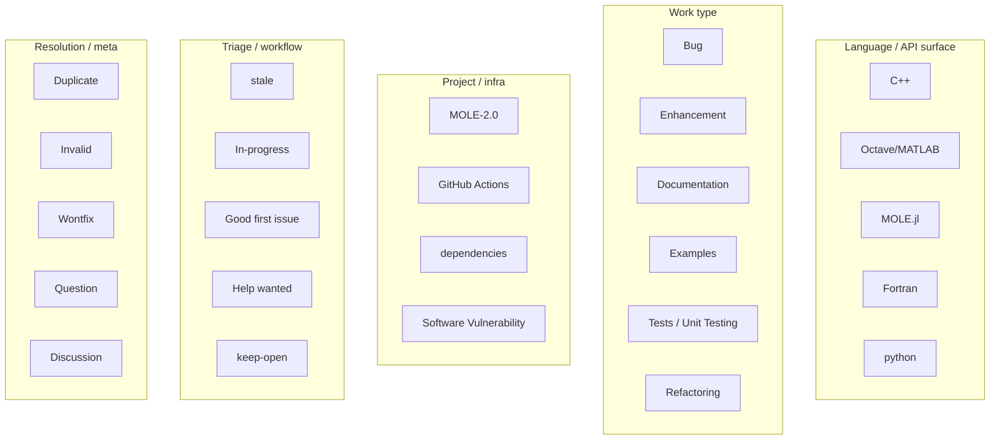

# Label analytics KPIs — plan

**Status:** Implemented (2026-06-29)
**Target repo example:** [csrc-sdsu/mole](https://github.com/csrc-sdsu/mole)  
**Last reviewed:** 2026-06-29

---

## Goal

Give maintainers actionable visibility into **how work flows through their label taxonomy**: which areas (language bindings, docs, bugs, MOLE 2.0, etc.) are getting attention, how fast items close, and where backlog is accumulating — using data we already collect from GitHub issues/PRs and timeline events.

This is not vanity label counting. The outcome is **triage and planning**: “Octave/MATLAB has 21 open items and a 117-day median age; Documentation closed 8 items this period with a 12-day median close; MOLE-2.0 opened 4 and merged 1.”

---

## Current state (audit)

### What we already have

| Layer | What exists | Notes |
| --- | --- | --- |
| **Collector** | GitHub issues, PRs, repo labels, timeline events (`labeled` / `unlabeled`) | No new API scopes needed |
| **Normalization** | `metric_labels` per item (labels at close for completed items, current labels for open) | Multi-label items appear under every label they carry |
| **Catalog** | `operations.labels[]` — name, color, description from GitHub | ~35 labels on MOLE |
| **Per-label snapshot** | `operations.label_metrics[]` — total, open, closed, issues, PRs, median_age_days, max_age_days | **All-time only** |
| **Global SLA** | `median_bug_close_days`, period throughput, engagement metrics | Bug detection via `_is_bug_label()` only |
| **UI** | Horizontal bar chart “Label workload” (top 8 labels, open vs closed) | Chart summary text incorrectly says “selected period” |
| **Table** | Label filter on operations table; label pills on rows | Works per canonical label name |
| **Infra (dormant)** | `canonical_label()` / `label_aliases` plumbing in `operations.py` | Aliases dict is always `{}`; removed from project YAML during cleanup refactor |

### Gaps vs maintainer questions

| Maintainer question | Today | Gap |
| --- | --- | --- |
| How much did we **close/merge per label this period**? | Global period summary only | No per-label period throughput |
| **Average/median close time per label**? | Global medians only | Not in `label_metrics` |
| Which **section** (C++, docs, Julia) gets exposure? | Raw per-label counts | No grouping / rollup |
| Are **duplicate labels** (Bug vs bug) skewing stats? | Counted separately | Aliases not configured |
| Is docs work **keeping up** with docs traffic? | Doc KPIs elsewhere | No label ↔ docs cross-view |
| Which labels drive **stale backlog**? | `stale` label visible | No “open age by category” rollup |

### Known bug to fix in any label work

`renderLabelChart()` in `web/src/app.js` filters all-time `label_metrics` but the chart summary says *“labels with activity in the selected period.”* Period-scoped label metrics must be computed in Python (or filtered client-side from `items[]`) and the copy must match.

---

## MOLE label taxonomy (csrc-sdsu/mole)

From live `operations.labels` / `label_metrics` in the MOLE dataset (~400 issues/PRs):

### Observed categories (maintainer mental model)



### MOLE signals worth surfacing (real numbers, all-time snapshot)

| Label / area | Open | Total | Median open age | Maintainer read |
| --- | ---: | ---: | ---: | --- |
| **Octave/MATLAB** | 21 | 25 | 117d | Largest language-surface backlog; mostly open issues |
| **stale** | 30 | 32 | 118d | Automation label ≠ healthy backlog; many still open |
| **Enhancement** | 8 | 35 | 275d | Long-lived feature requests |
| **Documentation** | 5 | 62 | 74d | Steady docs workload |
| **Bug** | 1 | 26 | 33d | Bugs close relatively fast when labeled |
| **C++** | 6 | 23 | 75d | Moderate API surface load |
| **MOLE.jl** | 2 | 22 | 69d | Julia track active but smaller |
| **MOLE-2.0** | (check live) | — | — | Roadmap bucket for 2.0 work |

### Duplicate / alias debt (MOLE)

These pairs split metrics today and should be merged via `label_aliases`:

| Canonical | Aliases |
| --- | --- |
| Bug | bug |
| Enhancement | enhancement |
| Documentation | documentation |
| Refactoring | refactoring |
| Discussion | discussion |
| Good first issue | good first issue |
| Octave/MATLAB | MATLAB/Octave *(if still present on older items)* |

---

## Brainstorm — useful KPIs

### Tier 1 — High value, low controversy (ship first)

**Per label (period-aware)**

1. **Opened in period** — issues/PRs created in period carrying label (at creation: current labels; optional: label-at-open from timeline).
2. **Closed / merged in period** — completed items whose `metric_labels` include label.
3. **Net change** — opened − closed/merged for label in period.
4. **Median time to close** — among items closed in period (or all-time toggle).
5. **Median time to merge** — PRs merged with label.
6. **Open now** — current backlog count (already exists; keep).
7. **Median open age** — among open items (already exists; keep).

**Per label group (rollup)**

8. **Backlog by section** — sum of open items per group (Languages, Work type, Roadmap, …).
9. **Throughput by section** — closed+merged in period per group.
10. **Median close time by section** — weighted or simple median across labeled completions.

**Overview / Operations KPIs (top groups only)**

11. **Hottest backlog section** — group with highest open count or highest median age.
12. **Most improved section** — largest period-over-period drop in open count or close-time median.
13. **Untriaged vs labeled ratio** — already partially covered; add “% items with language label” etc.

### Tier 2 — Deeper maintainer analytics

14. **Completion rate** — `closed_or_merged / (closed_or_merged + open)` per label (careful with multi-label).
15. **First-response SLA by label** — median `first_response_days` for open issues with label.
16. **Review latency by label** — median `first_review_days` for PRs with label.
17. **Stale burden** — open items with both `stale` and a domain label (e.g. stale + Octave/MATLAB).
18. **New contributor affinity** — % of label’s PRs from first-time authors (ties to newcomer funnel).
19. **Monthly label trend** — stacked or small-multiples chart: opened/closed per label by month (extend `monthly_trends`).
20. **Label co-occurrence** — top pairs (Documentation + MOLE.jl) for routing insights.

### Tier 3 — Cross-domain (optional, later)

21. **Docs labels vs doc traffic** — Documentation-labeled throughput vs RTD/GoatCounter views (same period).
22. **Bug labels vs security alerts** — correlate Software Vulnerability / Bug with Dependabot alerts.
23. **Release-linked labels** — items closed since last release by section (uses existing release dates).

### Explicitly out of scope (for now)

- Predictive “expected close date” models
- Full graph analytics on label transitions over time (expensive; timeline already collected but heavy)
- PyPI / citation attribution by label
- Replacing GitHub Projects views

---

## Label grouping strategy

MOLE uses **semantic labels** (language + type + roadmap), not GitHub’s default type/area/priority tripartite scheme. We need a grouping layer that works for MOLE and generic repos.

### Recommended approach: hybrid config + heuristics

```yaml
# projects/mole.yml (proposed)
reporting:
  label_aliases:
    bug: Bug
    enhancement: Enhancement
    documentation: Documentation
    # case-insensitive keys

  label_groups:
    - id: languages
      name: Language / API
      labels: [C++, "Octave/MATLAB", MOLE.jl, Fortran, python]
    - id: work_type
      name: Work type
      labels: [Bug, Enhancement, Documentation, Examples, Refactoring, Tests, "Unit Testing", format]
    - id: roadmap
      name: Roadmap & infra
      labels: [MOLE-2.0, "GitHub Actions", dependencies, "Software Vulnerability"]
    - id: community
      name: Community & triage
      labels: ["Good first issue", "Help wanted", Discussion, Question, "student project"]
    - id: workflow
      name: Workflow meta
      labels: [stale, In-progress, keep-open, Duplicate, Invalid, Wontfix]
      exclude_from_totals: true   # optional: don’t double-count in “work” rollups
```

**Auto-suggest (no config):** when `label_groups` is absent, derive a single “Uncategorized” bucket plus optional heuristics:

- GitHub default descriptions (“Good for newcomers”, “New feature or request”) → suggest group
- Dependabot label color patterns → `dependencies` group
- Never auto-merge Bug/bug without explicit alias (case-insensitive dedupe is safe)

**Primary label (optional future):** for rollups that must sum to 100%, use first matching group in priority order (`work_type` > `languages` > …). Document that default multi-label counts are **exposure** metrics (item counted in each label), not partition metrics.

---

## Data model (proposed JSON)

Extend `operations` in dashboard JSON:

```json
{
  "operations": {
    "label_metrics": [ /* existing all-time snapshot, enriched */ ],
    "label_metrics_by_period": {
      "12m": [
        {
          "label": "Documentation",
          "color": "0075ca",
          "opened": 12,
          "closed": 8,
          "merged": 4,
          "net_change": 0,
          "open": 5,
          "median_close_days": 14.2,
          "median_merge_days": 3.1,
          "p90_close_days": 45.0
        }
      ]
    },
    "label_group_metrics": {
      "12m": [
        {
          "group_id": "languages",
          "name": "Language / API",
          "open": 29,
          "opened": 20,
          "closed": 15,
          "merged": 18,
          "median_close_days": 22.5,
          "labels": ["C++", "Octave/MATLAB", "MOLE.jl"]
        }
      ]
    },
    "label_trends": {
      "months": ["2025-04", "2025-05"],
      "by_label": {
        "Documentation": { "opened": [2, 3], "closed": [1, 4] }
      }
    }
  }
}
```

**Enrich existing `label_metrics[]` (all-time):**

```json
{
  "median_close_days": 18.4,
  "median_merge_days": 2.9,
  "p90_close_days": 90.0,
  "completed": 57
}
```

**Metric definitions:** add entries in `build_dataset.py` `metric_definitions` for tooltips (median close by label, section throughput, etc.).

---

## Implementation plan

### Phase 0 — Fix & foundation (1–2 days)

| Task | Where | Detail |
| --- | --- | --- |
| Restore `label_aliases` in schema + YAML | `schema.py`, `projects/*.yml` | Wire into `build_operations(..., aliases=config.label_aliases)` (currently hardcoded `{}`) |
| Add MOLE aliases | `projects/mole.yml` | Merge Bug/bug, Documentation/documentation, etc. |
| Fix label chart period copy | `web/src/app.js` | Either compute period metrics or fix summary text |
| Unit tests | `tests/test_operations.py` | Alias merge, period filter, median close per label |

### Phase 1 — Per-label SLA & throughput (2–3 days)

| Task | Where | Detail |
| --- | --- | --- |
| `label_period_metrics(records, period)` | `metrics/operations.py` | For each canonical label: opened/closed/merged/net, medians |
| Enrich all-time `label_metrics` | same | Add median_close_days, median_merge_days, p90_close_days |
| `label_metrics_by_period` | `build_operations` output | Keyed by period id, same structure as period summaries |
| Period comparisons per label | optional | Top N labels only (delta vs previous period) |
| UI: upgrade Label workload chart | `web/src/app.js`, `index.html` | Period selector sync; toggle metric (open vs closed vs median close); use GitHub label colors |
| UI: label KPI strip | Operations section | Top 3–4 labels by open backlog + link to filtered table |

### Phase 2 — Label groups / sections (2–3 days)

| Task | Where | Detail |
| --- | --- | --- |
| `label_groups` schema | `schema.py`, docs | Optional list of `{ id, name, labels[], exclude_from_totals? }` |
| MOLE group config | `projects/mole.yml` | Categories as brainstormed above |
| `label_group_metrics(records, period, groups)` | `metrics/operations.py` | Roll up child label metrics |
| UI: “Work by section” panel | Operations | Horizontal bar or treemap: open + period closed per group |
| UI: section KPI on Overview | optional | “Language backlog: 29 open” linking to Operations with group filter |

### Phase 3 — Trends & advanced (3–4 days)

| Task | Where | Detail |
| --- | --- | --- |
| `label_trends` monthly series | `metrics/operations.py` | Extend `monthly_trends` pattern per label / group |
| Stale × domain cross-tab | metrics + UI | Table: stale items broken down by language label |
| First-response / review by label | metrics | Reuse per-record `first_response_days` / `first_review_days` |
| Report PDF section | `web/report.html` | Top sections table for printouts |
| Smoke / integration tests | `web/tests/` | DOM hooks, fixture JSON with multi-label items |

---

## UI sketch (Operations section)

```
Operations
├── [existing KPI strips]
├── Period progress
├── [existing charts: backlog, age]
├── Label intelligence          ← new subsection
│   ├── Group summary strip     (Languages | Work type | Roadmap — open / closed in period)
│   ├── Label workload chart    (period-aware; metric toggle)
│   ├── Label SLA table         (label | open | closed period | median close | median age)
│   └── [optional] Monthly trend by group (small multiples)
└── [existing operations table — add “group” filter]
```

**Table enhancements:**

- Filter by `label_group` (expands to OR of member labels)
- Click chart bar → set label filter (already partially supported via ops links pattern)

**Design notes:** reuse `kpi-strip-dense`, GitHub label colors on chart bars (`#${color}`), exclude workflow-meta group from default view toggle.

---

## Computation rules (normative)

1. **Label membership:** use `metric_labels` on each normalized item (labels at close for closed/merged items, current for open).
2. **Opened in period:** `created_at` in period AND label ∈ `metric_labels` *(current assignment; Phase 3+ can refine with timeline-at-open)*.
3. **Closed in period:** `closed_at` in period AND label ∈ `metric_labels`.
4. **Median close:** median of `days_to_close` for issues; `days_to_merge` for PRs; report issue vs PR counts separately when mixed.
5. **Multi-label:** default metrics count item in **every** applicable label; tooltips state this. Group rollups dedupe by item id within group (item counted once per group even if it has C++ and Bug).
6. **Exclude labels:** `(unlabeled)`, and optionally `Duplicate` / `Invalid` / `Wontfix` from “active work” denominators via config flag.
7. **Minimum sample size:** suppress median if `< 3` completed items; show “N/A (n=2)” in UI.

---

## Testing & QA checklist

- [ ] Bug + bug merge to single row after aliases
- [ ] Period change updates label chart and group strip
- [ ] MOLE Octave/MATLAB open count matches manual filter on operations table
- [ ] Multi-label issue appears in each label row but once in group rollup
- [ ] Median close for Documentation matches spot-check of 3–5 closed docs issues
- [ ] Chart colors match GitHub label colors
- [ ] Empty period shows empty state, not stale all-time data
- [ ] `npm run ci` + new pytest cases for label period metrics

---

## Effort summary

| Phase | Scope | Effort | Maintainer value |
| --- | --- | --- | --- |
| 0 | Aliases + bug fix | ~1–2 days | Correct baseline |
| 1 | Per-label throughput & SLA | ~2–3 days | Answers “how much” and “how fast” |
| 2 | Section rollups (MOLE categories) | ~2–3 days | Answers “which area gets exposure” |
| 3 | Trends & cross-metrics | ~3–4 days | Planning and retrospectives |

**Total:** ~8–12 days for full plan; **Phase 0+1** delivers the core ask in ~4 days.

---

## What I will do next (when approved)

1. Implement **Phase 0**: restore `label_aliases` in config schema, apply MOLE aliases, fix the period/chart mismatch, add pytest coverage.
2. Implement **Phase 1** Python metrics (`label_metrics_by_period`, enriched medians) and upgrade the Operations label chart + compact SLA table.
3. Add **MOLE `label_groups`** in YAML and ship the “Work by section” panel (Phase 2).
4. Defer monthly label trends and cross-domain correlations to Phase 3 unless prioritized.

No new GitHub API collectors are required — only richer aggregation over existing `items[]`, timeline events, and repo labels.
